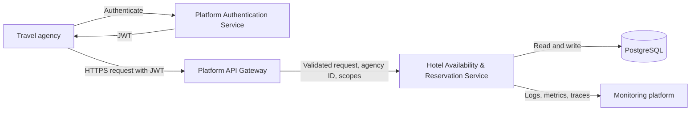

# 1. Architecture

## Why this design

The service must return hotel availability quickly and must not sell the same room twice. One backend service and PostgreSQL keep the booking transaction local and easy to reason about. Queues, caches, and several services are deferred until they solve a measured problem.

## Mental model

A hotel search reads a changing snapshot. A reservation turns selected daily availability into a confirmed booking in one database transaction: PostgreSQL writes both the inventory change and reservation, or neither. That is why the first version keeps the booking rules and source of truth in one service and one database.

## Architecture diagram

## Components

| Component | Responsibility | Why it exists | Communication |
| --- | --- | --- | --- |
| Travel agency | Searches hotels and creates reservations. | It is the API client in the scenario. | Calls the API Gateway over HTTPS. |
| Platform Authentication Service | Authenticates an agency and issues a JWT. | Authentication is a platform concern, not booking business logic. | Returns a JWT to the agency. It is not called for every booking request. |
| Platform API Gateway | Provides the public API entry point. It validates signed JWTs, applies request limits, and routes valid requests. | It protects the backend from invalid requests and excessive API use before the request reaches the service. | Receives HTTPS requests and forwards authenticated requests to the private service. |
| Hotel Availability & Reservation Service | Validates request data, searches availability, creates reservations, and applies booking rules. | It owns the business rules for hotel availability and reservations. | Receives the authenticated agency identity from the gateway and reads or writes PostgreSQL. |
| PostgreSQL | Stores hotel data, room types, daily availability, daily prices, and reservations. | The data has clear relationships and a reservation needs a transaction that commits all changes or none of them. | The service reads availability and prices, then writes inventory and reservations in one transaction. |
| Monitoring platform | Collects logs, metrics, and traces. | It helps engineers find slow requests, errors, and failed reservations. | The service sends operational signals to it. |

## Authentication and authorisation

The platform authentication service issues a JWT for a travel agency. The agency sends the JWT in the `Authorization` header when it calls the API.

The API Gateway validates the signed JWT before forwarding the request. It passes the authenticated `agencyId` and scopes to the private service. The service uses this identity for authorisation and reservation ownership; the request body never contains a caller-controlled agency ID.

The signature lets the gateway verify that a trusted service issued the token and that its claims were not changed. The gateway checks the token locally, so an existing valid token can still work during a temporary authentication-service outage. New logins or token refreshes may fail during that outage.

- Missing, invalid, or expired JWT: the gateway returns `401 Unauthorized`.
- Valid JWT without the required scope: the service returns `403 Forbidden`.
- The service is not publicly reachable, so a client cannot send a fake agency identity directly to it.

## API protection

The API Gateway applies rate and request limits before the service starts database work. Limits can differ by endpoint and should be configured from traffic data. This reduces repeated searches and reservation attempts from one agency. Network-level DDoS protection belongs to platform infrastructure.

## API style and HTTP contract

Travel agencies use a REST API over HTTPS with JSON request and response bodies. It provides a small, resource-based contract that clients can use with standard HTTP tools.

`GET /v1/hotels/availability` reads current availability and does not change data. `POST /v1/reservations` creates a reservation. The endpoint-specific request and response examples are described in [Part 2](02-availability-api.md) and [Part 4](04-reservation-api.md).

| Status | Meaning in this service |
| --- | --- |
| `200 OK` | A valid read request completed, including a search with no matching hotels. |
| `201 Created` | A reservation was created. The response includes its identifier and a `Location` header. |
| `400 Bad Request` | The request is missing required data or contains invalid values. The client can correct it. |
| `401 Unauthorized` | The JWT is missing, invalid, or expired. |
| `403 Forbidden` | The JWT is valid, but the agency does not have the required permission. |
| `404 Not Found` | A requested resource, such as a destination, hotel, or room type, does not exist. |
| `409 Conflict` | The request is valid, but the current inventory can no longer satisfy the reservation. |
| `429 Too Many Requests` | The gateway has applied a rate limit. It may include `Retry-After` to tell the client when to retry. |
| `5xx` | An unexpected server or dependency failure occurred. The client should not assume that a retry is always safe. |

Errors use `application/problem+json` with a stable type, a short explanation, useful field details where appropriate, and a request ID. They never expose stack traces, SQL, or JWT values.

## Availability and reservation data

Availability data and reservation data are logical groups inside the same PostgreSQL database.

- **Availability data** records the number of rooms left for each room type and date. It also stores the daily price.
- **Reservation data** records the confirmed booking, the agency, the dates, the status, and the selected room type. It keeps the confirmed total price as a historical value.

The reservation flow will lock the required daily availability rows for the selected room type, verify capacity, reduce inventory, and create the reservation in one database transaction. The concurrency details are described in [Part 5](05-concurrency.md).

## Decisions kept intentionally simple

### No queue in the first version

A reservation needs an immediate result. The client must know whether the rooms were confirmed or unavailable. A queue would make this result asynchronous and add failure and retry cases that are not needed here.

### No cache for live availability in the first version

Cached availability can be stale. PostgreSQL is the source of truth, and every reservation checks it again before confirmation. A later cache may hold stable hotel details or short-lived search results, but never decide availability or reservation idempotency.

### One service, not microservices

One service keeps the transaction and debugging path simple. A later split may be useful if a clear team, scale, or deployment boundary appears. It is not needed only because the platform has many hotels.

### One room type per reservation

The first version reserves one room type and a quantity of that type. This matches the assignment and keeps search, booking, and inventory checks straightforward. A future version can add reservation items and guest allocation per room.
