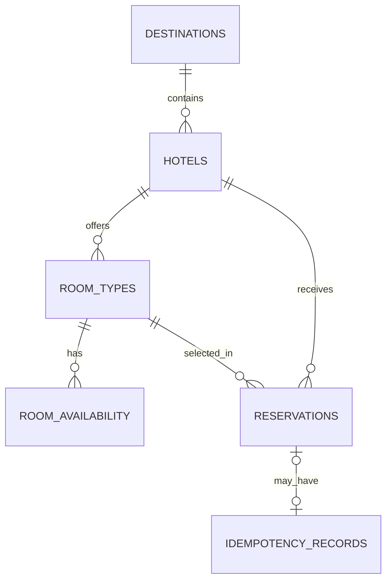

# 7. Database Design

## Goal

The relational model supports hotel search, daily availability, reservation confirmation, and safe retries. PostgreSQL provides the transactions, foreign keys, constraints, indexes, and row-level locks needed for this workflow.

## Mental model

Each table owns one kind of fact: a room type describes an offer, daily availability stores its sellable quantity and price, and a reservation stores what was confirmed. Row constraints protect simple facts; the reservation transaction protects rules across dates, such as not selling the same room twice.

## Entity relationship diagram

`agency_id` is stored on a reservation but has no local foreign key. The authentication platform owns agency data, and the service receives this ID from a validated JWT.

## Tables

All primary keys use `BIGINT` values generated by PostgreSQL as identity columns. The API can expose opaque identifiers independently of this internal database choice.

### `destinations`

| Column | Purpose |
| --- | --- |
| `destination_id` | Primary key. |
| `name` | Display name, such as Osaka. |
| `center_latitude`, `center_longitude` | Reference point for distance sorting. |

The platform destination catalogue is the source for these stable IDs and names; this local table supports hotel search and relationships.

### `hotels`

| Column | Purpose |
| --- | --- |
| `hotel_id` | Primary key. |
| `destination_id` | Foreign key to `destinations`. |
| `name` | Hotel display name. |
| `star_rating` | Official hotel category from 1 to 5. |
| `latitude`, `longitude` | Used for distance sorting. |

### `room_types`

| Column | Purpose |
| --- | --- |
| `room_type_id` | Primary key. |
| `hotel_id` | Foreign key to `hotels`. |
| `name` | Short room type name, such as Deluxe Room. |
| `description` | Useful room details, such as bed or view information. |
| `max_adults` | Maximum number of adult guests per room. |

A room type belongs to one hotel, so a "Deluxe Room" at two hotels has two rows.

### `room_availability`

| Column | Purpose |
| --- | --- |
| `room_type_id` | Foreign key to `room_types`. Part of the primary key. |
| `stay_date` | Calendar date. Part of the primary key. |
| `available_rooms` | Number of rooms of this type that can still be sold on this date. |
| `daily_price_amount` | Current daily room price used to calculate a reservation. |
| `currency` | Currency for the daily price, for example `JPY`. |

The composite primary key is `(room_type_id, stay_date)`. It gives one daily inventory row for each room type and prevents duplicates for the same date.

This is a quantity, not one row per physical room: `available_rooms = 10` means ten rooms can be sold that date. A reservation locks, verifies, and reduces the row; different dates or room types can proceed in parallel.

Keeping price beside daily availability is the simplest room-and-date pricing model. A price update changes matching rows but never an already confirmed total. A later rate-plan feature can add separate tables.

### `reservations`

| Column | Purpose |
| --- | --- |
| `reservation_id` | Primary key. |
| `agency_id` | Agency from the authenticated JWT. |
| `hotel_id`, `room_type_id` | Selected hotel and room type. |
| `check_in`, `check_out` | Confirmed stay dates. |
| `number_of_rooms` | Confirmed quantity of the selected room type. |
| `adult_guest_count` | Total adult guests in this first version. |
| `confirmed_total_amount`, `currency` | Final confirmed price. |
| `taxes_and_fees_included` | Records how the confirmed total must be interpreted. |
| `status` | `CONFIRMED` in this first version. |
| `created_at` | Creation time for support, incident investigation, and future booking analysis. |

The reservation keeps its confirmed total rather than recalculating current daily prices. `check_in` and `check_out` are `DATE` values; `created_at` is a timestamp for the booking time.

### `idempotency_records`

| Column | Purpose |
| --- | --- |
| `idempotency_record_id` | Primary key. |
| `agency_id`, `idempotency_key` | Identifies one logical reservation request for one agency. |
| `request_fingerprint` | Distinguishes a real retry from reuse of the key with different reservation data. |
| `reservation_id` | Optional foreign key to the confirmed reservation. |
| `response_status`, `response_body` | Stored result returned to a retry. |
| `created_at`, `expires_at` | Defines the configurable retry window. |

This technical table, not reservation history, is retained for the configurable 24-hour retry window in [Part 6](06-duplicate-requests.md).

## Keys and relationships

- Every table has one stable, not-null primary key. An identity column generates it; the primary key constraint enforces uniqueness.
- `hotels.destination_id` references `destinations.destination_id`.
- `room_types.hotel_id` references `hotels.hotel_id`.
- `room_availability.room_type_id` references `room_types.room_type_id`.
- `reservations` stores both `hotel_id` and `room_type_id`. A composite foreign key references `room_types(hotel_id, room_type_id)`, so the database rejects a room type that belongs to another hotel. `room_types` therefore has a unique constraint on `(hotel_id, room_type_id)`.
- `idempotency_records.reservation_id` references `reservations.reservation_id` when a reservation was confirmed.

Hotels, room types, and reservations are historical data. Deletes are rejected while related data exists; the first version does not cascade-delete them.

## Important indexes

Primary keys and unique constraints enforce uniqueness with indexes. Additional indexes follow real access paths:

| Index | Why it exists |
| --- | --- |
| `hotels(destination_id)` | Finds hotels for a requested destination. |
| `room_types(hotel_id)` | Finds a hotel's room types. |
| Primary key `room_availability(room_type_id, stay_date)` | Finds and locks the daily rows used by a reservation. |
| Unique `idempotency_records(agency_id, idempotency_key)` | Prevents two logical reservation operations from using the same key for the same agency. |

Indexes speed reads and joins but add write work. The first version includes only search, reservation, and idempotency paths; listing reservations by agency can add an index when that endpoint exists.

## Important constraints

All business fields listed above are `NOT NULL` unless they are explicitly optional. In particular, the hotel, room type, dates, quantities, price, status, and required foreign keys cannot be absent. `idempotency_records.reservation_id` is the exception because a stored conflict response may not create a reservation.

| Table | Constraint | Why it matters |
| --- | --- | --- |
| `hotels` | `star_rating BETWEEN 1 AND 5` | Rejects invalid hotel categories. |
| `room_types` | `max_adults >= 1` | A room must support at least one adult. |
| `room_availability` | `available_rooms >= 0` | Prevents negative inventory. |
| `room_availability` | `daily_price_amount >= 0` | Prevents negative prices. |
| `reservations` | `check_out > check_in` | A stay needs at least one night. |
| `reservations` | `number_of_rooms > 0` and `adult_guest_count > 0` | Prevents invalid quantities. |
| `reservations` | `confirmed_total_amount >= 0` | Prevents invalid confirmed prices. |
| `reservations` | `status IN ('CONFIRMED')` | Limits this first version to its supported status. |
| `idempotency_records` | `expires_at > created_at` | Ensures a valid retry window. |

Some rules span several rows: enough inventory on every stay date and adult capacity for the selected rooms. The reservation transaction locks availability rows and checks those rules together, as described in [Part 5](05-concurrency.md).
